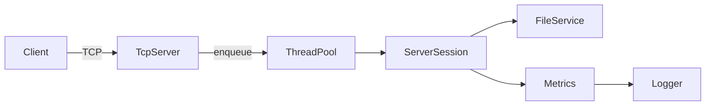
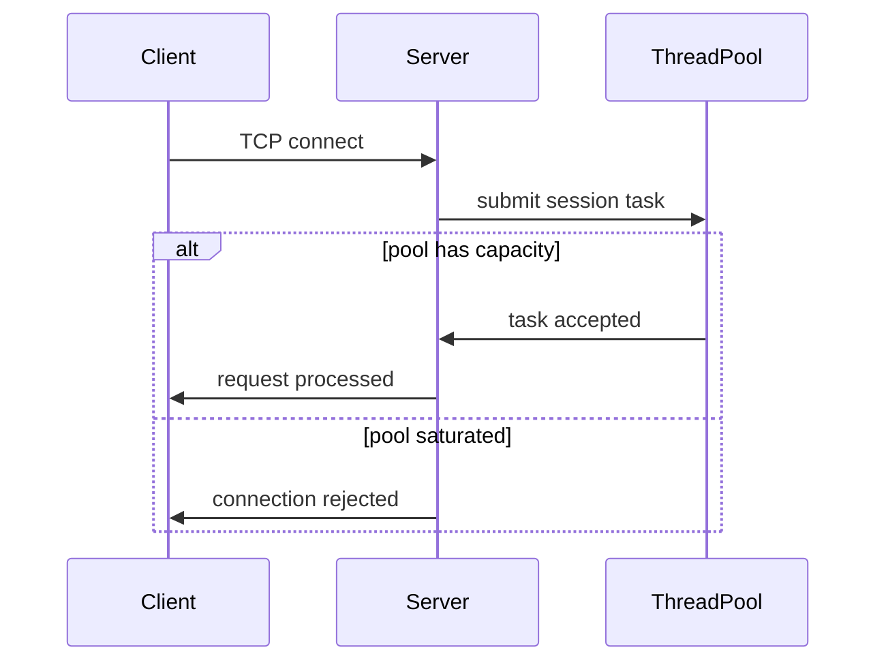

# Multithreaded TCP File Server

A **production-grade TCP file server** implemented in **modern C++ (C++17)**, designed to demonstrate **networking fundamentals, concurrency control, reliability, and observability** in a real-world infrastructure-style system.

The server supports concurrent clients for **file listing and uploads**, enforces **backpressure under load**, handles failures explicitly, and exposes **internal metrics** for operational visibility.

---

## Core Capabilities

### Networking & Protocol
- TCP-based client–server architecture using POSIX sockets
- Simple, deterministic, line-based protocol for commands and metadata
- Persistent connections with per-request handling
- Binary-safe file transfers

### Concurrency & Backpressure
- Bounded worker thread pool for connection handling
- Fixed-capacity task queue to prevent unbounded resource usage
- Graceful rejection of new connections when saturated
- Deterministic concurrency limits under load

### Reliability & Fault Handling
- Safe handling of client disconnects and timeouts
- Cleanup of partially uploaded files on failure
- Graceful shutdown on `SIGINT` (Ctrl+C)
- Explicit socket lifecycle management
- Idle connection timeouts to prevent resource leaks

### Observability & Metrics
- Active connection tracking
- Request and failure counters
- Request latency measurement
- Periodic metrics snapshots written to logs
- Metrics designed for easy extension to external monitoring systems

### Clean, Modular Architecture
- Clear separation of responsibilities:
  - `TcpServer` — socket setup, accept loop, shutdown handling
  - `ServerSession` — per-connection protocol handling
  - `FileService` — filesystem operations
  - `ThreadPool` — bounded concurrency and backpressure
  - `metrics` — internal observability
  - `utils` — logging and socket helpers
- Modular CMake-based build
- CLion-friendly project layout

---

## High-Level Architecture



---

## Build Instructions

### Prerequisites
- CMake ≥ 3.16
- C++17-compatible compiler
- Linux or macOS

### Build
```bash
mkdir build
cd build
cmake ..
cmake --build .
```

This produces two executables:
- `server`
- `client`

---

## Running the Server

```bash
./server
```

Expected output:
```
Server started. Listening on port 9100
```

Runtime logs and metrics are written to `log.txt`.

---

## Running the Client

### List files on the server
```bash
./client list
```

### Upload a file
```bash
./client put example.txt
```

---

## Protocol Overview

The system uses a **simple, explicit TCP protocol** designed for clarity and debuggability.

### Commands
- `list`
- `put`

### File Listing (`list`)
```text
client → server: list\n
server → client: <file_count>\n
server → client: <filename_1>\n
server → client: <filename_2>\n
```

### File Upload (`put`)
```text
client → server: put\n
client → server: <filename>\n
client → server: <filesize>\n
client → server: <binary data>
server → client: Uploaded file <filename>\n
```

---

## Concurrency & Backpressure Model



---

## Metrics & Observability

The server maintains internal metrics such as:
- Active connections
- Total requests processed
- Failed requests
- Average request latency (microseconds)

Metrics are periodically logged in the following format:

```
METRICS | active_connections=3 total_requests=87 failed_requests=2 avg_latency_us=914
```

---

## Design Principles

- **Failure-aware by default**: disconnects, timeouts, and partial writes are expected
- **Operational mindset**: metrics over assumptions
- **Explicit concurrency control**: no reliance on “OS will handle it”
- **Minimal abstractions**: standard C++ and POSIX APIs only
- **Extensible foundation**: easy to add authentication, TLS, or external monitoring

---

## Possible Extensions
- TLS support
- Authentication and authorization
- Structured (JSON) logging
- Prometheus / statsd metrics export
- Distributed file storage backend

---

## Author

**Arjun Varma**  
Computer Science student focused on:
- Networking and distributed systems
- Infrastructure and production engineering
- High-performance C++ systems

---